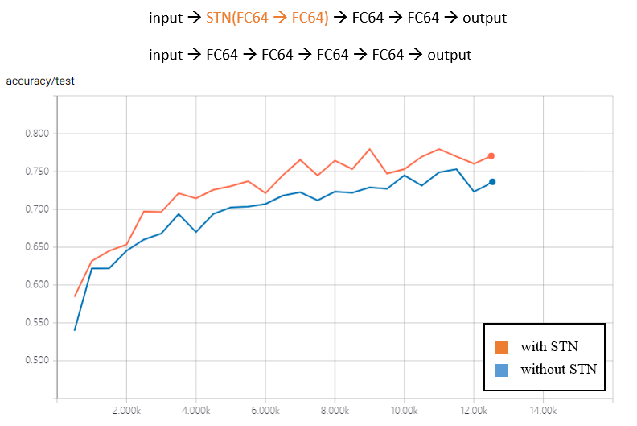
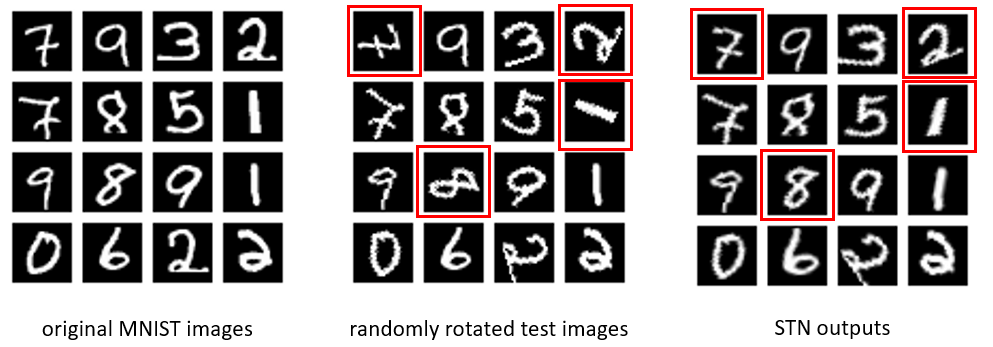

# TensorFlow implementation of STN

This is a TensorFlow implementation of the following paper:
>[Spatial Transformer Networks](http://papers.nips.cc/paper/5854-spatial-transformer-networks)

The code can only run in the [Eager Execution](https://www.tensorflow.org/guide/eager).

## Results
### Compared with a normal fully connected network:

### STN outputs:

